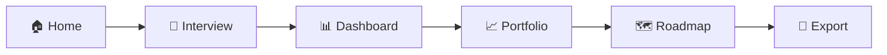

<div align="center">

# ✨ CanvasIQ

### AI-Powered Strategic Planning for Enterprise AI Initiatives

[](https://nextjs.org/)
[](https://react.dev/)
[](https://www.typescriptlang.org/)
[](https://openai.com/)
[](https://tailwindcss.com/)
[](LICENSE)

**Build your AI strategy with confidence.** CanvasIQ guides you through capturing use cases, computing ROI, selecting your portfolio, and generating a strategic roadmap—all powered by an intelligent AI consultant.

[Live Demo](#) · [Report Bug](../../issues) · [Request Feature](../../issues)


</div>

---

## 🎯 What is CanvasIQ?

CanvasIQ is a conversational AI agent that helps organizations plan and prioritize their AI investments. Through an intelligent interview process, it captures your AI use cases, automatically calculates financial metrics, helps you build an optimized portfolio, and generates a complete **AI ROI & Roadmap Canvas**—a single-page strategic document ready for executive presentations.

### The Problem

Organizations struggle to:
- Quantify the ROI of AI initiatives before investing
- Prioritize competing AI projects with limited budgets
- Create cohesive multi-year AI roadmaps
- Communicate AI strategy to stakeholders effectively

### The Solution

CanvasIQ provides a structured, AI-guided approach to strategic planning that transforms vague AI ambitions into data-driven investment decisions with clear financial justification.

---

## ✨ Features

### 🤖 AI-Powered Interview
- **Conversational guidance** through company context, use case capture, and strategic planning
- **Real-time streaming responses** for natural interaction
- **Intelligent data extraction** automatically parses financial figures and project details
- **Math tool integration** for precise ROI calculations during conversation

### 📊 Comprehensive ROI Analysis
| Metric | Description |
|--------|-------------|
| **Basic ROI** | (Annual Benefits - Total Costs) / Total Costs × 100 |
| **Net Present Value** | 3-year NPV at 10% discount rate |
| **Payback Period** | Months to recover initial investment |
| **Risk-Adjusted Value** | NPV weighted by risk level and effort/impact ratio |

### 📈 Portfolio Optimization
- **Impact-Effort Matrix** with four quadrants:
  - 🚀 **Quick Wins** — High Impact, Low Effort (prioritize first)
  - ⭐ **Strategic Projects** — High Impact, High Effort (plan carefully)
  - 📋 **Fill-Ins** — Low Impact, Low Effort (if budget allows)
  - ⚠️ **Reconsider** — Low Impact, High Effort (deprioritize)
- **Budget-constrained auto-selection** optimizes portfolio within constraints
- **Interactive selection** with real-time metrics updates

### 🗺️ Roadmap Generation
- **Three-horizon planning**: Q1 (Quick Wins), 1-Year (Strategic), 3-Year (Transformational)
- **Dependency tracking** ensures logical sequencing
- **Milestone visualization** with timeline view
- **Risk distribution** analysis across timeframes

### 📄 Multi-Format Export
- **JSON** — Structured data for integration with other tools
- **Markdown** — Human-readable documentation
- **PDF** — Print-ready single-page canvas for presentations

---

## 🖼️ Canvas Output

The generated AI ROI & Roadmap Canvas includes all sections needed for executive communication:

| Section | Contents |
|---------|----------|
| **Header** | Title, Company, Designer, Date, Version |
| **Objectives** | Primary Goal, Strategic Focus Areas |
| **Inputs** | Resources, Personnel, External Support |
| **Impacts** | Hard Benefits ($), Soft Benefits |
| **Timeline** | Q1 / 1-Year / 3-Year initiatives with milestones |
| **Risks** | Risk name, Likelihood, Impact, Mitigation |
| **Capabilities** | Skills Needed, Technology Stack |
| **Costs** | Near-Term, Long-Term, Annual Maintenance |
| **Benefits** | Near-Term, Long-Term, Soft Benefits |
| **Portfolio ROI** | Near-Term ROI%, Long-Term ROI%, Summary |

---

## 🚀 Quick Start

### Prerequisites
- Node.js 18+ 
- OpenAI API Key ([Get one here](https://platform.openai.com/api-keys))

### Installation

```bash
# Clone the repository
git clone https://github.com/yourusername/canvasiq.git
cd canvasiq

# Install dependencies
npm install

# Set up environment variables
cp env.example .env.local
```

Add your OpenAI API key to `.env.local`:
```env
OPENAI_API_KEY=sk-your-api-key-here
```

### Run the Development Server

```bash
npm run dev
```

Open [http://localhost:3000](http://localhost:3000) to start building your AI strategy.

---

## 🛠️ Tech Stack

| Category | Technology |
|----------|------------|
| **Framework** | [Next.js 16](https://nextjs.org/) (App Router) |
| **Frontend** | [React 19](https://react.dev/) |
| **Language** | [TypeScript 5](https://www.typescriptlang.org/) |
| **Styling** | [Tailwind CSS 4](https://tailwindcss.com/) + [shadcn/ui](https://ui.shadcn.com/) |
| **AI/LLM** | [OpenAI GPT-5.1](https://openai.com/) with streaming & tool calling |
| **State Management** | [Zustand](https://zustand-demo.pmnd.rs/) with persistence |
| **Charts** | [Recharts](https://recharts.org/) |
| **Icons** | [Lucide React](https://lucide.dev/) |

---

## 📁 Project Structure

```
canvasiq/
├── app/
│   ├── page.tsx                 # Landing page
│   ├── interview/page.tsx       # AI chat interview
│   ├── dashboard/page.tsx       # ROI metrics overview
│   ├── portfolio/page.tsx       # Impact-Effort matrix
│   ├── roadmap/page.tsx         # Timeline visualization
│   ├── canvas/page.tsx          # Export & preview
│   ├── api/
│   │   ├── chat/route.ts        # Streaming chat endpoint with tool calling
│   │   └── extract/route.ts     # Structured data extraction
│   └── layout.tsx
├── components/
│   ├── ui/                      # shadcn/ui components
│   ├── chat/                    # Chat interface components
│   └── Navigation.tsx
├── lib/
│   ├── openai.ts                # OpenAI client configuration
│   ├── calculations.ts          # ROI computation engine
│   ├── canvas-schema.ts         # TypeScript type definitions
│   ├── prompts.ts               # System prompts & phase instructions
│   ├── math-tool.ts             # Math evaluation tool for agent
│   └── export.ts                # Export utilities (JSON, Markdown)
├── store/
│   └── canvas-store.ts          # Zustand store with persistence
└── public/
```

---

## 🎮 Usage Flow



1. **Home** — Overview and introduction to CanvasIQ
2. **Interview** — Chat with the AI to capture company context and use cases
3. **Dashboard** — Review automatically calculated ROI metrics
4. **Portfolio** — Prioritize using the Impact-Effort matrix
5. **Roadmap** — Assign timeframes and visualize the timeline
6. **Export** — Download your canvas in JSON, Markdown, or PDF

---

## 🧪 Demo Mode

Each page includes a **"Load Demo Data"** button that populates the system with sample AI use cases for demonstration:

- Customer Service Chatbot
- Predictive Maintenance
- Demand Forecasting
- Document Processing AI
- AI-Powered Recommendations

---

## 📐 ROI Formulas

### Basic ROI
```
ROI = (Annual Benefits - Total Costs) / Total Costs × 100
```

### Net Present Value (NPV)
```
NPV = Σ (Cash Flow / (1 + 0.10)^t) - Initial Investment
```
*Where t = years (1 to 3)*

### Payback Period
```
Payback (months) = Implementation Cost / Monthly Net Benefit
```

### Risk-Adjusted Value
```
Value = NPV × Risk Multiplier × (Impact Score / Effort Score)
```
*Risk Multipliers: Low = 1.0, Medium = 0.8, High = 0.6*

---

## 🔧 Configuration

### Environment Variables

| Variable | Description | Required |
|----------|-------------|----------|
| `OPENAI_API_KEY` | Your OpenAI API key | ✅ Yes |

### Customization

- **Prompts**: Modify `lib/prompts.ts` to customize the AI's behavior and interview flow
- **Calculations**: Adjust `lib/calculations.ts` to change discount rates or risk multipliers
- **Schema**: Update `lib/canvas-schema.ts` to extend canvas sections
- **Styling**: Customize theme in `app/globals.css`

---

## 🤝 Contributing

Contributions are welcome! Please feel free to submit a Pull Request.

1. Fork the repository
2. Create your feature branch (`git checkout -b feature/AmazingFeature`)
3. Commit your changes (`git commit -m 'Add some AmazingFeature'`)
4. Push to the branch (`git push origin feature/AmazingFeature`)
5. Open a Pull Request

---

## 📝 License

This project is licensed under the MIT License - see the [LICENSE](LICENSE) file for details.

---

## 🙏 Acknowledgments

- Built with [Next.js](https://nextjs.org/) and [React](https://react.dev/)
- UI components from [shadcn/ui](https://ui.shadcn.com/)
- Icons by [Lucide](https://lucide.dev/)
- Powered by [OpenAI](https://openai.com/)

---

<div align="center">

**Built with ❤️ by [Noah Hicks](https://github.com/yourusername)**

⭐ Star this repo if you find it useful!

</div>
