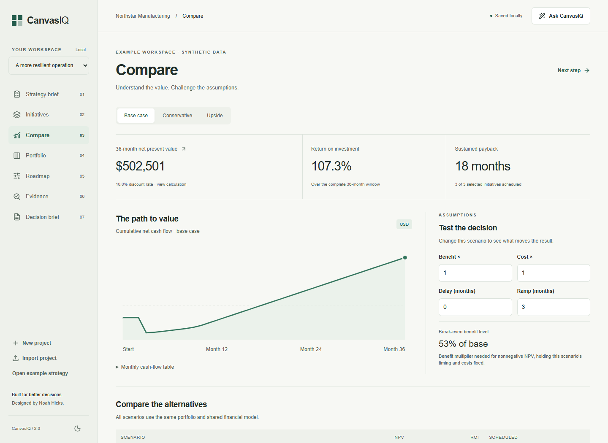
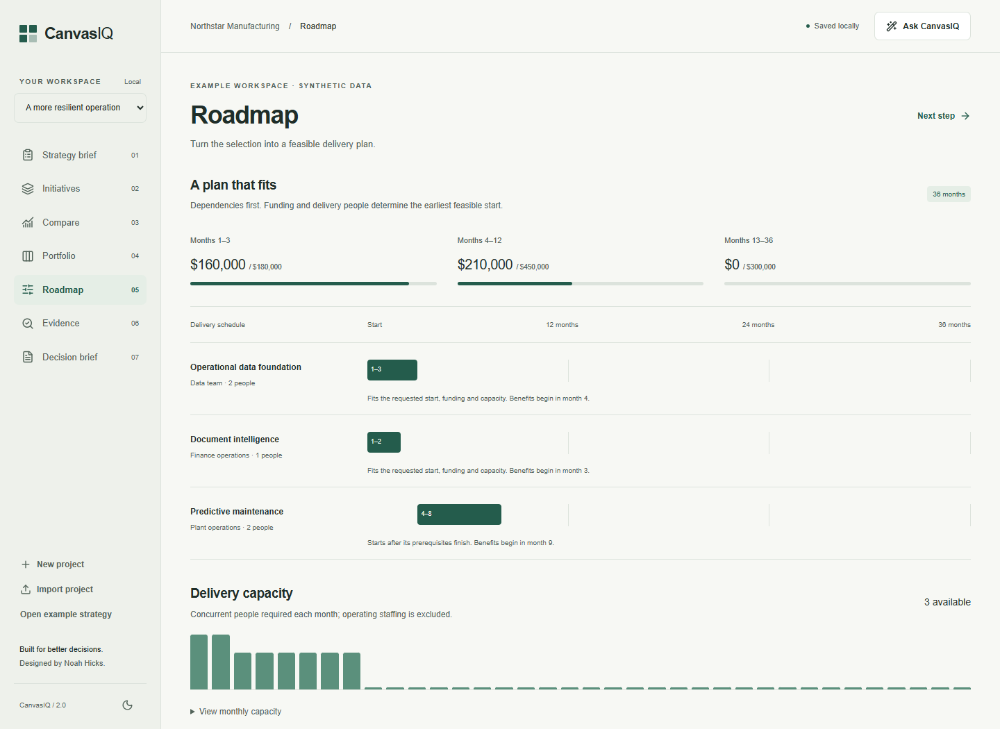

<div align="center">


# CanvasIQ

### Better AI investments start with better decisions.

A strategy workbench for comparing AI initiatives, challenging assumptions, and building a portfolio you can explain.

[](https://github.com/RedLynx101/CanvasIQ-Roadmap-Canvas-Agent/actions/workflows/ci.yml)
[](LICENSE)
[](package.json)

[Get started](#run-it-locally) · [Example decision brief](docs/examples/northstar-decision.pdf) · [Design case study](docs/design-case-study.md) · [Architecture](docs/architecture.md)

</div>



**A complete planning workflow. No API key required.** Start with a brief, capture initiatives, compare scenarios, choose a feasible portfolio, and export a decision record with its assumptions and evidence. An optional AI assistant helps you ask better questions and proposes changes for review.

## From possibilities to a defensible plan

| Step        | What you can do                                                                                                       |
| ----------- | --------------------------------------------------------------------------------------------------------------------- |
| **Frame**   | Define the operating outcome, decision owner, funding windows and delivery capacity.                                  |
| **Compare** | Model monthly cash flows, launch delays, adoption ramps and break-even sensitivity.                                   |
| **Choose**  | Explore impact/effort tradeoffs and a dependency-aware portfolio recommendation.                                      |
| **Plan**    | Schedule against funding and people; see unresolved prerequisites as explicit blockers.                               |
| **Explain** | Keep an evidence ledger and decision snapshots; export JSON, Markdown, or a printable brief with a complete appendix. |



## Why the engineering matters

- **One deterministic model.** The UI, assistant tools, exports and CLI share the same financial and scheduling functions. Unknown estimates remain unknown.
- **Inspectable recommendations.** Up to 12 initiatives use exhaustive subset selection under a fixed earliest-fit scheduler; larger portfolios use a clearly labeled heuristic. Neither claims a globally optimal schedule.
- **AI with boundaries.** One Agents SDK agent, typed output, read-only calculation tools, bounded requests, cancellation, and explicit acceptance before a draft changes project state.
- **Useful without a service account.** Browser-local projects, import/export, dark mode and keyboard-accessible editing work without a provider key.

Read the [financial model](docs/financial-model.md), [architecture](docs/architecture.md), and [security/data boundaries](SECURITY.md).

## Run it locally

Use **Node 24**.

```sh
git clone https://github.com/RedLynx101/CanvasIQ-Roadmap-Canvas-Agent.git
cd CanvasIQ-Roadmap-Canvas-Agent
npm ci
npm run dev
```

Open [localhost:3000](http://localhost:3000) and choose **Explore an example**. Northstar Manufacturing is a synthetic fixture with uncertain benefits, a data-foundation prerequisite and constrained delivery capacity. Switch to the conservative scenario to see the decision change.

The [hosted demo](https://canvasiq.replit.app/) is deployed separately and may lag this repository. See the [deployment handoff](docs/deployment.md) before redeploying or enabling AI.

## Work from Codex or the terminal

The repository includes a [canvasiq skill](skills/canvasiq/SKILL.md). Install its folder into your Codex skills directory to invoke `/canvasiq`. It diagnoses missing evidence and helps identify the minimum viable discovery or pilot workflow.

```sh
npx tsx scripts/canvasiq.ts example --output example.json
npx tsx scripts/canvasiq.ts diagnose --input example.json
npx tsx scripts/canvasiq.ts brief --input example.json --output decision.md
npx tsx scripts/canvasiq.ts handoff --input example.json --output discovery.json
```

CLI commands are deterministic and make no network calls. Promethean handoffs are portable discovery briefs with `executionAuthorized: false`; they do not execute or share anything automatically.

## Verify it

```sh
npm run check
npx playwright install chromium
npm run test:e2e
```

Checks cover financial edge cases, prerequisite failures, import validation, provider boundaries, arbitrary streaming chunks, recovery, the manual journey, and automated accessibility checks. [Verification evidence](docs/verification.md) records the release checks. [Live evaluations](evals/README.md) are separate, synthetic, explicitly invoked and excluded from ordinary tests.

<details>
<summary>Repository map</summary>

```text
app/          Next.js routes and application theme
features/     Brief, initiatives, comparison, portfolio, roadmap and exports
domain/       Validated schemas, finance, scheduling, migration and decisions
server/ai/    Optional assistant and admission controls
store/        Browser-local workspace and recovery
data/         Shared synthetic example
scripts/      CLI and reproducible screenshot capture
skills/       Codex workflow diagnosis skill
tests/        Domain, API and browser verification
docs/         Architecture, methods, deployment, case study and examples
```

</details>

## Honest boundaries

CanvasIQ models assumptions; it does not guarantee savings or investment outcomes. Capacity covers delivery people, not operating staffing. Browser storage is not an organizational account, encrypted vault or cloud backup. Export projects you want to keep. Optional AI sends planning context to OpenAI after consent and requires a controlled deployment; use synthetic or non-sensitive data in public demos.

[Contributing](CONTRIBUTING.md) · [Changelog](CHANGELOG.md) · [MIT license](LICENSE)

Built by [Noah Hicks](https://github.com/RedLynx101).
