<div align="center">

# ✨ CanvasIQ

### AI-Powered Strategic Planning for Enterprise AI Initiatives

[](https://nextjs.org/)
[](https://react.dev/)
[](https://www.typescriptlang.org/)
[](https://openai.com/)
[](https://tailwindcss.com/)
[](LICENSE)

**Build your AI strategy with confidence.** CanvasIQ guides you through capturing use cases, computing ROI, selecting your portfolio, and generating a strategic roadmap—all powered by an intelligent AI consultant.

<br />

### 🚀 [Try the Live Demo →](https://canvasiq.replit.app/)

<br />

[Report Bug](../../issues) · [Request Feature](../../issues)

</div>

---

## 🎯 What is CanvasIQ?

CanvasIQ is a conversational AI agent that helps organizations plan and prioritize their AI investments. Through an intelligent interview process, it captures your AI use cases, automatically calculates financial metrics, helps you build an optimized portfolio, and generates a complete **AI ROI & Roadmap Canvas**—a single-page strategic document ready for executive presentations.

### The Problem

Organizations struggle to:
- Quantify the ROI of AI initiatives before investing
- Prioritize competing AI projects with limited budgets
- Create cohesive multi-year AI roadmaps
- Communicate AI strategy to stakeholders effectively

### The Solution

CanvasIQ provides a structured, AI-guided approach to strategic planning that transforms vague AI ambitions into data-driven investment decisions with clear financial justification.

---

## 🎮 Try It Now

**[Launch CanvasIQ →](https://canvasiq.replit.app/)**

Want to test it out? Copy and paste this sample prompt into the interview chat:

<details>
<summary><b>📋 Click to expand sample prompt</b></summary>

```
Hi! I'm the CTO at Tartan Solutions, a mid-sized manufacturing company in the automotive parts industry. We have about 2,000 employees and $150M in annual revenue. Our budget for AI initiatives this year is $1.5 million.

We're looking to implement AI across several areas. Let me share our top use cases:

1. Predictive Quality Control - We have a 3% defect rate that costs us $2M annually in rework and returns. We believe AI vision systems could reduce this to under 1%. Implementation would cost around $400K with $80K annual maintenance. This is high impact but requires significant effort to integrate with our production lines.

2. Demand Forecasting - Our inventory carrying costs are $1.5M/year due to poor forecasting. An ML model could improve accuracy by 25%, saving $500K annually. Cost: $150K implementation, $40K/year. Medium effort, medium-high impact.

3. Chatbot for Supplier Inquiries - Our procurement team spends 30% of time on routine supplier questions. A chatbot could save $300K in labor annually. Cost: $80K implementation, $20K/year. Low effort, medium impact.

4. Predictive Maintenance for CNC Machines - Unplanned downtime costs us $800K/year. Predictive maintenance could reduce this by 60%. Cost: $250K implementation, $60K/year. High effort and high impact, but depends on IoT sensor installation.

5. Document Processing for Compliance - We spend $400K/year on manual compliance document review. AI could automate 70% of this. Cost: $120K implementation, $30K/year. Low effort, high impact.

Can you help me analyze these and build our AI roadmap?
```

</details>

This prompt demonstrates a realistic enterprise scenario with:
- ✅ Company context (industry, size, budget)
- ✅ 5 diverse AI use cases
- ✅ Financial estimates (costs & benefits)
- ✅ Effort/impact assessments
- ✅ Dependencies between projects

---

## ✨ Features

### 🤖 AI-Powered Interview
- **Conversational guidance** through company context, use case capture, and strategic planning
- **Real-time streaming responses** for natural interaction
- **Intelligent data extraction** automatically parses financial figures and project details
- **Math tool integration** for precise ROI calculations during conversation

### 📊 Comprehensive ROI Analysis
| Metric | Description |
|--------|-------------|
| **Basic ROI** | (Annual Benefits - Total Costs) / Total Costs × 100 |
| **Net Present Value** | 3-year NPV at 10% discount rate |
| **Payback Period** | Months to recover initial investment |
| **Risk-Adjusted Value** | NPV weighted by risk level and effort/impact ratio |

### 📈 Portfolio Optimization
- **Impact-Effort Matrix** with four quadrants:
  - 🚀 **Quick Wins** — High Impact, Low Effort (prioritize first)
  - ⭐ **Strategic Projects** — High Impact, High Effort (plan carefully)
  - 📋 **Fill-Ins** — Low Impact, Low Effort (if budget allows)
  - ⚠️ **Reconsider** — Low Impact, High Effort (deprioritize)
- **Budget-constrained auto-selection** optimizes portfolio within constraints
- **Interactive selection** with real-time metrics updates

### 🗺️ Roadmap Generation
- **Three-horizon planning**: Q1 (Quick Wins), 1-Year (Strategic), 3-Year (Transformational)
- **Dependency tracking** ensures logical sequencing
- **Milestone visualization** with timeline view
- **Risk distribution** analysis across timeframes

### 📄 Multi-Format Export
- **JSON** — Structured data for integration with other tools
- **Markdown** — Human-readable documentation
- **PDF** — Print-ready single-page canvas for presentations

---

## 🖼️ Canvas Output

The generated AI ROI & Roadmap Canvas includes all sections needed for executive communication:

| Section | Contents |
|---------|----------|
| **Header** | Title, Company, Designer, Date, Version |
| **Objectives** | Primary Goal, Strategic Focus Areas |
| **Inputs** | Resources, Personnel, External Support |
| **Impacts** | Hard Benefits ($), Soft Benefits |
| **Timeline** | Q1 / 1-Year / 3-Year initiatives with milestones |
| **Risks** | Risk name, Likelihood, Impact, Mitigation |
| **Capabilities** | Skills Needed, Technology Stack |
| **Costs** | Near-Term, Long-Term, Annual Maintenance |
| **Benefits** | Near-Term, Long-Term, Soft Benefits |
| **Portfolio ROI** | Near-Term ROI%, Long-Term ROI%, Summary |

---

## 🚀 Quick Start

### Prerequisites
- Node.js 18+ 
- OpenAI API Key ([Get one here](https://platform.openai.com/api-keys))

### Installation

```bash
# Clone the repository
git clone https://github.com/yourusername/canvasiq.git
cd canvasiq

# Install dependencies
npm install

# Set up environment variables
cp env.example .env.local
```

Add your OpenAI API key to `.env.local`:
```env
OPENAI_API_KEY=sk-your-api-key-here
```

### Run the Development Server

```bash
npm run dev
```

Open [http://localhost:3000](http://localhost:3000) to start building your AI strategy.

---

## 🛠️ Tech Stack

| Category | Technology |
|----------|------------|
| **Framework** | [Next.js 16](https://nextjs.org/) (App Router) |
| **Frontend** | [React 19](https://react.dev/) |
| **Language** | [TypeScript 5](https://www.typescriptlang.org/) |
| **Styling** | [Tailwind CSS 4](https://tailwindcss.com/) + [shadcn/ui](https://ui.shadcn.com/) |
| **AI/LLM** | [OpenAI GPT-5.1](https://openai.com/) with streaming & tool calling |
| **State Management** | [Zustand](https://zustand-demo.pmnd.rs/) with persistence |
| **Charts** | [Recharts](https://recharts.org/) |
| **Icons** | [Lucide React](https://lucide.dev/) |

---

## 📁 Project Structure

```
canvasiq/
├── app/
│   ├── page.tsx                 # Landing page
│   ├── interview/page.tsx       # AI chat interview
│   ├── dashboard/page.tsx       # ROI metrics overview
│   ├── portfolio/page.tsx       # Impact-Effort matrix
│   ├── roadmap/page.tsx         # Timeline visualization
│   ├── canvas/page.tsx          # Export & preview
│   ├── api/
│   │   ├── chat/route.ts        # Streaming chat endpoint with tool calling
│   │   └── extract/route.ts     # Structured data extraction
│   └── layout.tsx
├── components/
│   ├── ui/                      # shadcn/ui components
│   ├── chat/                    # Chat interface components
│   └── Navigation.tsx
├── lib/
│   ├── openai.ts                # OpenAI client configuration
│   ├── calculations.ts          # ROI computation engine
│   ├── canvas-schema.ts         # TypeScript type definitions
│   ├── prompts.ts               # System prompts & phase instructions
│   ├── math-tool.ts             # Math evaluation tool for agent
│   └── export.ts                # Export utilities (JSON, Markdown)
├── store/
│   └── canvas-store.ts          # Zustand store with persistence
└── public/
```

---

## 🎮 Usage Flow

```mermaid
graph LR
    A[🏠 Home] --> B[💬 Interview]
    B --> C[📊 Dashboard]
    C --> D[📈 Portfolio]
    D --> E[🗺️ Roadmap]
    E --> F[📄 Export]
```



1. **Home** — Overview and introduction to CanvasIQ
2. **Interview** — Chat with the AI to capture company context and use cases
3. **Dashboard** — Review automatically calculated ROI metrics
4. **Portfolio** — Prioritize using the Impact-Effort matrix
5. **Roadmap** — Assign timeframes and visualize the timeline
6. **Export** — Download your canvas in JSON, Markdown, or PDF

---

## 📐 ROI Formulas

### Basic ROI
```
ROI = (Annual Benefits - Total Costs) / Total Costs × 100
```

### Net Present Value (NPV)
```
NPV = Σ (Cash Flow / (1 + 0.10)^t) - Initial Investment
```
*Where t = years (1 to 3)*

### Payback Period
```
Payback (months) = Implementation Cost / Monthly Net Benefit
```

### Risk-Adjusted Value
```
Value = NPV × Risk Multiplier × (Impact Score / Effort Score)
```
*Risk Multipliers: Low = 1.0, Medium = 0.8, High = 0.6*

---

## 🔧 Configuration

### Environment Variables

| Variable | Description | Required |
|----------|-------------|----------|
| `OPENAI_API_KEY` | Your OpenAI API key | ✅ Yes |

### Customization

- **Prompts**: Modify `lib/prompts.ts` to customize the AI's behavior and interview flow
- **Calculations**: Adjust `lib/calculations.ts` to change discount rates or risk multipliers
- **Schema**: Update `lib/canvas-schema.ts` to extend canvas sections
- **Styling**: Customize theme in `app/globals.css`

---

## 🤝 Contributing

Contributions are welcome! Please feel free to submit a Pull Request.

1. Fork the repository
2. Create your feature branch (`git checkout -b feature/AmazingFeature`)
3. Commit your changes (`git commit -m 'Add some AmazingFeature'`)
4. Push to the branch (`git push origin feature/AmazingFeature`)
5. Open a Pull Request

---

## 📝 License

This project is licensed under the MIT License - see the [LICENSE](LICENSE) file for details.

---

## 🙏 Acknowledgments

- Built with [Next.js](https://nextjs.org/) and [React](https://react.dev/)
- UI components from [shadcn/ui](https://ui.shadcn.com/)
- Icons by [Lucide](https://lucide.dev/)
- Powered by [OpenAI](https://openai.com/)

---

<div align="center">

### 🚀 [Try CanvasIQ Now →](https://canvasiq.replit.app/)

**Built with ❤️ by [Noah Hicks](https://github.com/yourusername)**

⭐ Star this repo if you find it useful!

</div>
