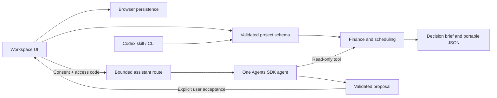

# Architecture

CanvasIQ is a single Next.js application with a shared deterministic TypeScript domain layer. It has no database or organization tenancy. Its manual workflow works without network access to a model provider once the application is loaded.

## Boundaries

- `domain/`: Zod schemas, monthly cash flows, fixed-order scheduling, subset selection, sensitivity, migration, exports and proposal application. No provider or browser dependencies.
- `data/`: one synthetic fixture shared by the UI, CLI, tests and examples.
- `store/`: browser-local projects, theme, persisted conversations and recovery status. Project JSON is the portable backup format. Legacy v1 storage is read without deletion; ambiguous funding and external prerequisites require review.
- `features/`: focused screens and shared accessible controls. Native form controls and dialogs provide semantics and focus behavior.
- `server/ai/`: optional typed agent, access checks, byte limits, durable admission ledger, cancellation and sanitized failures.
- `scripts/` and `skills/`: the same engine exposed for repeatable inspection and minimum viable workflow diagnosis.
- `tests/`: domain/API invariants plus browser journey and accessibility checks.

The assistant uses the official Agents SDK with a structured final answer and one read-only planning tool. It proposes one initiative at a time. It cannot execute workflows, mutate the project, access arbitrary files or browse external services. Server-side validation and explicit UI acceptance determine whether a draft can become project state. Stale proposals are rejected if the underlying project changed.

Provider output is received as a validated final object, transported with status/error/result SSE events. The client buffers frames and UTF-8 across network chunks. Text fragments are never scraped for JSON or workflow transitions. Manual editing is the primary interaction; there are no arbitrary initiative-count gates.

Provider tracing and response storage are disabled by the application. This does not override the provider's applicable service retention policy. Requests contain active planning data and recent conversation; they should not contain confidential inputs in a public demo.

## Why not more infrastructure?

A shared domain layer provides the useful reuse now. Adding a service fleet, several agents, billing, connectors or real-time collaboration would create access and consistency requirements without improving the first user's decision. Those remain separate product decisions. Before multi-instance AI deployment, replace or centralize the file-backed admission ledger.

Official references used during implementation: [Agents guide](https://developers.openai.com/api/docs/guides/agents), [typed agents](https://openai.github.io/openai-agents-js/guides/agents/), [run limits and cancellation](https://openai.github.io/openai-agents-js/guides/running-agents/), [Luna model](https://developers.openai.com/api/docs/models/gpt-5.6-luna). Dependency and model choices were checked September 5, 2026.
