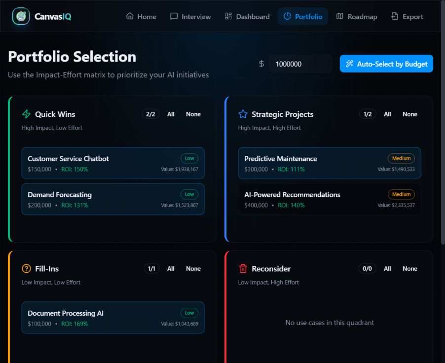

# From AI demo to decision workbench

The original CanvasIQ had a coherent end-to-end idea: capture initiatives, compute ROI, select a portfolio and export a roadmap. Its interface buried comparisons beneath large metric cards, combined several accent colors and glow treatments, and treated a long chat exchange as the main input form.

The redesign starts from a different interaction: a person needs to inspect a decision. The workspace therefore pairs readable tables and restrained charts with editable assumptions, evidence and an optional assistant.

## Before

The initial review used actual application screenshots and source inspection, not user interviews or fabricated usability metrics. It found clickable nonsemantic selection tiles, automatic greeting calls, fixed template milestones, and different definitions of near-term costs and ROI.

## After

The new system uses a warm neutral surface, one teal accent, aligned numbers, compact navigation and a side inspector. Selected states have explicit controls. A project can be built manually without an API key. Dark mode preserves the same hierarchy.

The more important changes are inspectable: monthly finance is shared across screens and exports; a dependency can block a schedule; uncertainty remains visible; a model proposal requires review. The example deliberately contains a negative standalone foundation project that can enable a more valuable downstream initiative.

## What this demonstrates

- Product judgment: reduce the first workflow to brief, assumptions, comparison and a defensible decision.
- Systems thinking: use one domain model for UI, assistant tools, exports and CLI.
- Reliability: validate imports/provider proposals, budget requests, preserve recoverable state and test boundary cases.
- Communication: explain methods and limitations, with screenshots and a synthetic example others can reproduce.

No conversion, productivity or customer-outcome improvements are claimed. Those require real usage research. The tests and screenshots establish implemented behavior; they do not establish enterprise readiness.
